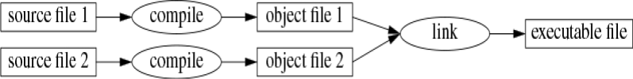

# 1.2 程序

C++是种编译型语言（compiled language）。要让程序能够运行，其源代码必须先经过编译器的处理，生成目标文件。
然后再由链接器将这些目标文件合并起来，最终得到可执行的程序。
通常，一个C++程序由多个源代码文件组成（通常简称为*源文件*(source files)）。



可执行程序是为特定的硬件/系统组合而创建的，不具备可移植性。例如，无法直接从 Android 设备拿到 Windows PC 上运行。
当我们谈论 C++ 程序的可移植性时，通常指的是源代码的可移植性；即同一份源代码能够在多种不同的系统上成功编译并运行。

ISO C++ 标准定义了两种实体：

- 核心语言特性，例如内置类型（如 `char` 和 `int`）和循环（如 `for` 语句和 `while` 语句）

- 标准库组件，例如容器（如 `vector` 和 `map`）以及 I/O 操作（如 `<<` 和 `getline()`）

标准库中的各个组件都是非常普通的C++代码，这些代码存在于所有的C++实现中。也就是说，C++标准库完全可以用C++本身来实现；当然，在处理`线程`上下文切换之类的任务时，会少量使用到机器码。这意味着 C++ 在表达能力和效率上都足以应对要求最严苛的系统编程任务。

C++ 是一种静态类型语言。这意味着，每一个实体（例如对象、值、名称和表达式）的类型都必须在编译时、在其被使用的位置为编译器所知。对象的类型决定了可以应用于它的操作集合以及它在内存中的布局方式。

## 1.2.1 Hello, World!

最小的 C++ 程序是

```cpp
int main(){}    // 最小的 C++ 程序
```

这定义了一个名为`main`的函数，该函数不接受任何参数，也不会执行任何操作。

花括号 `{ }` 在 C++ 中用于表示分组。它们标识函数体的开始和结束。
斜线 `//` 表示注释的开始，注释一直延伸到行尾。注释是写给人看的，编译器会忽略它们。

每个 C++ 程序都必须且只有一个名为 `main()` 的全局函数。
程序从执行该函数开始。`main()` 返回的 `int` 整数值（如果有）即为程序返回给"系统"的返回值。
如果没有返回值，系统会收到一个表示成功完成的值。`main()` 返回非零值表示失败。
并非所有操作系统和执行环境都会使用这个返回值：基于 Linux/Unix 的环境会使用，而 Windows 环境则很少使用。通常，程序会产生一些输出。

这里有一个程序，它会输出 `Hello, World!`：

```cpp
import std;

int main()
{
    std::cout << "Hello, World!\n";
}
```

import std; 这行代码的作用是告诉编译器：让标准库的声明变得可用。
如果没有这些声明，
```cpp
    std::cout << "Hello, World!\n";
```
这行代码就没意义了。`<<` 运算符（"放入"）的作用是把右边的值写到左边。这里的字符串字面量 `"Hello, World!\n"` 被送到标准输出流 `std::cout` 里。字符串字面量就是双引号括起来的一串字符。反斜杠 `\` 加一个字符表示一个特殊字符，比如 `\n` 是换行，所以实际输出的是 `Hello, World!` 然后换行。
`std::` 表示名称 `cout` 位于标准库的命名空间（[§3.3](../ch03/33-namespace.md) ）中。在讨论标准特性时，我通常会省略 `std::`；[§3.3](../ch03/33-namespace.md) 会展示如何在不使用显式限定的情况下，让命名空间中的名称变得可见。
`import` 指令是 C++20 中新增的，但以模块 `std` 的形式提供整个标准库尚未成为标准。这一点将在 [§3.2.2](../ch03/32-separate-compilation.md#3.2.2)  中解释。
如果你在使用 `import std;` 时遇到问题，可以尝试传统且常用的方式：

```cpp
#include <iostream>            // 包含 I/O 流库的声明

int main() 
{ 
    std::cout << "Hello, World!\n"; 
}
```

这将在 [§3.2.1](../ch03/32-separate-compilation.md#3.2.1) 中解释，并且自 1998 年（§19.1.1）以来在所有 C++ 实现上都能工作。
基本上，所有可执行代码都放在函数中，并直接或间接地从 `main()` 调用。

```cpp
import std;             // 从标准库导入声明
using namespace std;    //  让 std 中的名字在不使用 std:: 的情况下变得可见 (§3.3) 

double square(double x) // 计算一个双精度浮点数的平方
{ 
    return x*x; 
} 

void print_square(double x) 
{ 
    cout << "the square of " << x << " is " << square(x) << "\n"; 
} 

int main() 
{ 
    print_square(1.234);      // 打印: the square of 1.234 is 1.52276 
}
```
如果"返回类型"为`void`，表示该函数不返回任何值。
