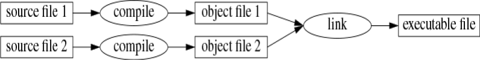

# 基础知识

> **我们首先要做的，就是把律师统统干掉。**
>
> —— 亨利六世中篇四幕第二场

# 1.1 引言

本章非正式地介绍 C++ 的语法表示、C++ 的内存与计算模型，以及将代码组织成程序的基本机制。这些语言特性所支持的编程风格在 C 语言中最为常见，有时也被称为*过程式*编程[^1]。

[^1]: 过程式编程（procedural programming）是一种以过程（函数）为中心的编程风格，强调程序的顺序执行。

# 1.2 程序

C++是种编译型语言（compiled language）。要让程序能够运行，其源代码必须先经过编译器的处理，生成目标文件。
然后再由链接器将这些目标文件合并起来，最终得到可执行的程序。
通常，一个C++程序由多个源代码文件组成（通常简称为*源文件*(source files)）。



可执行程序是为特定的硬件/系统组合而创建的，不具备可移植性。例如，无法直接从 Android 设备拿到 Windows PC 上运行。
当我们谈论 C++ 程序的可移植性时，通常指的是源代码的可移植性；即同一份源代码能够在多种不同的系统上成功编译并运行。

ISO C++ 标准定义了两种实体：

- 核心语言特性，例如内置类型（如 `char` 和 `int`）和循环（如 `for` 语句和 `while` 语句）

- 标准库组件，例如容器（如 `vector` 和 `map`）以及 I/O 操作（如 `<<` 和 `getline()`）

标准库中的各个组件都是非常普通的C++代码，这些代码存在于所有的C++实现中。也就是说，C++标准库完全可以用C++本身来实现；当然，在处理`线程`上下文切换之类的任务时，会少量使用到机器码。这意味着 C++ 在表达能力和效率上都足以应对要求最严苛的系统编程任务。

C++ 是一种静态类型语言。这意味着，每一个实体（例如对象、值、名称和表达式）的类型都必须在编译时、在其被使用的位置为编译器所知。对象的类型决定了可以应用于它的操作集合以及它在内存中的布局方式。

## 1.2.1 Hello, World!

最小的 C++ 程序是

```cpp
int main(){}    // 最小的 C++ 程序
```

这定义了一个名为`main`的函数，该函数不接受任何参数，也不会执行任何操作。

花括号 `{ }` 在 C++ 中用于表示分组。它们标识函数体的开始和结束。
斜线 `//` 表示注释的开始，注释一直延伸到行尾。注释是写给人看的，编译器会忽略它们。

每个 C++ 程序都必须且只有一个名为 `main()` 的全局函数。
程序从执行该函数开始。`main()` 返回的 `int` 整数值（如果有）即为程序返回给"系统"的返回值。
如果没有返回值，系统会收到一个表示成功完成的值。`main()` 返回非零值表示失败。
并非所有操作系统和执行环境都会使用这个返回值：基于 Linux/Unix 的环境会使用，而 Windows 环境则很少使用。通常，程序会产生一些输出。

这里有一个程序，它会输出 `Hello, World!`：

```cpp
import std;

int main()
{
    std::cout << "Hello, World!\n";
}
```

import std; 这行代码的作用是告诉编译器：让标准库的声明变得可用。
如果没有这些声明，
```cpp
    std::cout << "Hello, World!\n";
```
这行代码就没意义了。`<<` 运算符（"放入"）的作用是把右边的值写到左边。这里的字符串字面量 `"Hello, World!\n"` 被送到标准输出流 `std::cout` 里。字符串字面量就是双引号括起来的一串字符。反斜杠 `\` 加一个字符表示一个特殊字符，比如 `\n` 是换行，所以实际输出的是 `Hello, World!` 然后换行。
`std::` 表示名称 `cout` 位于标准库的命名空间（[§3.3](../ch03/3-3-namespace.md) ）中。在讨论标准特性时，我通常会省略 `std::`；[§3.3](../ch03/3-3-namespace.md) 会展示如何在不使用显式限定的情况下，让命名空间中的名称变得可见。
`import` 指令是 C++20 中新增的，但以模块 `std` 的形式提供整个标准库尚未成为标准。这一点将在 [§3.2.2](../ch03/3-2-separate-compilation.md#3.2.2)  中解释。
如果你在使用 `import std;` 时遇到问题，可以尝试传统且常用的方式：

```cpp
#include <iostream>            // 包含 I/O 流库的声明

int main() 
{ 
    std::cout << "Hello, World!\n"; 
}
```

这将在 [§3.2.1](../ch03/3-2-separate-compilation.md#3.2.1) 中解释，并且自 1998 年（§19.1.1）以来在所有 C++ 实现上都能工作。
基本上，所有可执行代码都放在函数中，并直接或间接地从 `main()` 调用。

```cpp
import std;             // 从标准库导入声明
using namespace std;    //  让 std 中的名字在不使用 std:: 的情况下变得可见 (§3.3) 

double square(double x) // 计算一个双精度浮点数的平方
{ 
    return x*x; 
} 

void print_square(double x) 
{ 
    cout << "the square of " << x << " is " << square(x) << "\n"; 
} 

int main() 
{ 
    print_square(1.234);      // 打印: the square of 1.234 is 1.52276 
}
```
如果"返回类型"为`void`，表示该函数不返回任何值。

# 1.3 函数

在 C++ 程序中，完成任务的主要方式是调用一个函数。定义函数就是指定一个操作如何执行。函数必须先被声明才能被调用。

函数声明给出函数的名字、返回值类型（如果有的话），以及调用时必须提供的参数个数和类型。例如：

```cpp
Elem* next_elem();            // 无参数，返回指向 Elem 的指针（Elem*）
void exit(int);               // int 参数，无返回值
double sqrt(double);          // double 参数，返回值类型为 double
```

在函数声明中，返回值类型写在函数名之前，参数类型写在函数名之后的圆括号内。

参数传递的语义与初始化的语义完全相同（[§3.4.1](../ch03/3-4-parameters.md#3.4.1)）。也就是说，参数类型会被检查，并且必要时会进行隐式类型转换（[§1.4](../ch01/1-4-types-variables.md)）。例如：

```cpp
double s2 = sqrt(2);               // 以参数 double{2} 调用 sqrt()
double s3 = sqrt("three");         // 错误：sqrt() 需要 double 类型的参数
```

这种编译时检查和类型转换的价值不应被低估。

函数声明中可以包含参数名。这有助于程序的读者理解，但除非该声明同时也是函数定义，否则编译器会完全忽略这些名字。例如：

```cpp
double sqrt(double d);       // 返回 d 的平方根
double square(double);       // 返回参数的平方
```

函数的类型由它的返回值类型后跟圆括号内的参数类型序列组成。例如：

```cpp
double get(const vector<double>& vec, int index);   // 类型：double(const vector<double>&, int)
```

函数可以是类的成员（[§2.3](../ch02/2-3-class.md)、[§5.2.1](../ch05/5-2-concrete-types.md)）。对于这种*成员函数*，其类名也是函数类型的一部分。例如：

```cpp
char& String::operator[](int index);                // 类型：char& String::(int)
```

我们希望代码易于理解，因为这是走向可维护性的第一步。可理解性的第一步是将计算任务拆分成有意义的小块（表现为函数和类），并给它们命名。这些函数随后提供计算的基本词汇，正如类型（内置类型和用户定义类型）提供数据的基本词汇一样。C++ 标准算法（例如 `find`、`sort`、`iota`）提供了一个很好的开始（[第 13 章](../ch13/index.md)）。接下来，我们可以将表示通用或特定任务的函数组合成更大型的计算任务。

代码中的错误数量与代码量和代码复杂度密切相关。这两个问题都可以通过使用更多、更短的函数来解决。使用函数执行特定任务，常常能避免我们在其他代码中间编写一段特定代码；将某操作写成函数，迫使我们给该活动命名并记录其依赖关系。如果我们找不到合适的名字，很可能存在设计问题。

如果两个函数的名称相同但参数类型不同，编译器会为每次调用选择最合适的函数进行调用。例如：

```cpp
void print(int);          // 接受整数参数
void print(double);       // 接受浮点数参数
void print(string);       // 接受字符串参数

void user()
{
    print(42);            // 调用 print(int)
    print(9.65);          // 调用 print(double)
    print("Barcelona");   // 调用 print(string)
}
```

如果两个可选函数都能被调用，但两者都不比对方更优，则这次调用被认为是有歧义的，编译器会报错。例如：

```cpp
void print(int, double);
void print(double, int);

void user2()
{
    print(0, 0);          // 错误：有歧义的调用，无法确定调用哪个函数
}
```

定义多个同名函数被称为**函数重载**，是泛型编程[（§8.2）](../ch08/8-2-concepts.md)的核心部分之一。当一个函数被重载时，每个同名函数应该实现相同的语义。`print()` 函数就是这样的例子：每个 `print()` 都打印它的参数。

# 1.4 类型、变量和算术运算

每个名称和表达式都有一个类型，类型决定了可以对它执行哪些操作。例如，声明

```cpp
int inch;
```

指明 `inch` 的类型是 `int`，也就是说，`inch` 是一个整型变量。

**声明** 语句，向程序中引入一个实体并指定其类型。

- 一个**类型**定义了一组可能的取值和一组（针对对象的）操作。
- 一个**对象**是保存某个类型的值的一块内存。
- 一个**值**是根据某个类型解释的一组比特位。
- 一个**变量**是一个有名字的对象。

C++ 提供了种类繁多（a small zoo）的基本类型，但因为我并不是动物学家，所以就不把它们全部列出。你可以在参考资源（例如网上的 [Cppreference][^1]）中找到它们。例如：

[^1]: Online source for C++ language and standard library facilities.
www.cppreference.com.

```cpp
bool                 // 布尔类型，可能的值为 true 和 false
char                 // 字符，例如 'a'、'z' 和 '9'
int                  // 整数，例如 -273、42 和 1066
double               // 双精度浮点数，例如 -273.15、3.14
unsigned             // 非负整数，例如 0、1 和 999（用于位逻辑运算）
```

每种基本数据类型都对应着特定的硬件资源，其大小是固定的。这种固定大小决定了该数据类型所能存储的数值范围。


`char`（字符型）变量的大小正好适合存储某台机器上所能表示的一个字符的容量（通常为8位字节）。而其他数据类型的大小则是字符型大小的整数倍。某种数据类型的大小是由具体的实现方式决定的，因此不同机器上的数值可能有所不同。可以通过`sizeof`运算符来获取某种数据的大小。例如，`sizeof(char)`的值为1，而`sizeof(int)`通常为4。如果我们需要使用特定大小的数据类型，可以使用标准库中的别名形式来表示，比如`int32_t`（§17.8）。

数字可以是浮点数或整数。

- 浮点字面量通过小数点（例如 `3.14`）或指数（例如 `314e-2`）来识别。
- 整数字面量默认是十进制（例如 `42` 表示四十二）。前缀 `0b` 表示二进制（基数为 2）整数字面量（例如 `0b10101010`）。前缀 `0x` 表示十六进制（基数为 16）整数字面量（例如 `0xBAD12CE3`）。前缀 `0` 表示八进制（基数为 8）整数字面量（例如 `0334`）。

为了让较长的字面量更可读，我们可以使用单引号 `'` 作为数字分隔符。例如，π 大约为 `3.14159'26535'89793'23846'26433'83279'50288`，或者如果你更喜欢十六进制表示，可以写成 `0x3.243F'6A88'85A3'08D3`。

## 1.4.1 算术运算

算术运算符可用于基本类型的适当组合：

```cpp
x+y         // 加法
+x          // 一元正号
x-y         // 减法
-x          // 一元负号
x*y         // 乘法
x/y         // 除法
x%y         // 整数取余（模运算）
```

比较运算符同样可用：

```cpp
x==y        // 相等
x!=y        // 不等
x<y         // 小于
x>y         // 大于
x<=y        // 小于等于
x>=y        // 大于等于
```

此外，还提供了逻辑运算符：

```cpp
x&y         // 按位与
x|y         // 按位或
x^y         // 按位异或
~x          // 按位补
x&&y        // 逻辑与
x||y        // 逻辑或
!x          // 逻辑非（取反）
```

按位逻辑运算符的结果是操作数类型，其每一比特上都执行了相应的操作。逻辑运算符 `&&` 和 `||` 则根据操作数的值简单地返回 `true` 或 `false`。

在赋值和算术运算中，C++ 会在基本类型之间执行所有有意义的转换，使得它们可以自由混用：

```cpp
void some_function()    // 无返回值的函数
{
    double d = 2.2;     // 初始化浮点数
    int i = 7;          // 初始化整数
    d = d + i;          // 将和赋给 d
    i = d * i;          // 将乘积赋给 i；注意：将 double 乘积 d*i 截断为 int
}
```

表达式中使用的转换称为**常用算术转换**，旨在确保表达式以操作数中最高的精度进行计算。例如，`double` 和 `int` 的加法会使用双精度浮点运算。

注意，`=` 是赋值运算符，`==` 测试相等性。

除了传统的算术和逻辑运算符，C++ 还提供了一些更具体的修改变量的操作：

```cpp
x += y       // x = x + y
++x          // 自增：x = x + 1
x -= y       // x = x - y
--x          // 自减：x = x - 1
x *= y       // 缩放：x = x * y
x /= y       // 缩放：x = x / y
x %= y       // x = x % y
```

这些操作符简洁方便，使用频率非常高。

对于`x.y`、`x->y`、`x(y)`、`x[y]`、`x<<y`、`x>>y`、`x&&y` 和 `x||y`这类表达式，其计算顺序是从左到右。而对于赋值操作（例如`x+=y`），则计算顺序是从右到左。由于与优化相关的历史原因，其他类型表达式的计算顺序（比如`f(x)+g(y)`以及函数参数的顺序（比如`h(f(x),g(y))`）目前尚未明确规定。

## 1.4.2 初始化

在某个对象能够被使用之前，必须先为其赋值。C++提供了多种初始化方式，比如上面使用的“=”符号；此外，还有一种通用的初始化方式，即使用大括号来界定初始化列表。

```cpp
double d1 = 2.3;                              // 将 d1 初始化为 2.3
double d2 {2.3};                              // 将 d2 初始化为 2.3
double d3 = {2.3};                            // 将 d3 初始化为 2.3（使用 { ... } 时 = 是可选的）

complex<double> z = 1;                        // 双精度浮点复数
complex<double> z2 {d1, d2};
complex<double> z3 = {d1, d2};                // 使用 { ... } 时 = 是可选的

vector<int> v {1, 2, 3, 4, 5, 6};             // 一个 int 向量
```

“=”这种形式比较传统，其起源可以追溯到C语言时代。不过，如果不确定该使用哪种形式，那就选择`{}`这种通用形式吧。至少这样能避免因转换而导致的数据丢失问题。

```cpp
int i1 = 7.8;              // i1 变成 7（惊讶吗？）
int i2 {7.8};              // 错误：浮点向整数转换（窄化转换）
```

不幸的是，会丢失信息的转换，即**窄化转换**（例如从 `double` 到 `int`，以及从 `int` 到 `char`），在 C++ 中是允许的，并且在你使用 = 赋值时会被隐式执行（但使用 `{}` 初始化时不会）。隐式窄化转换所带来的问题，是为了兼容 C 语言而付出的代价（见 §19.3）。

常量（S1.6）绝不能保持未初始化的状态，而变量也只有在极少数情况下才应被保持为未初始化状态。在为某个变量确定合适的值之前，千万不要给它命名。用户定义的类型（例如 `string`、`vector`、`Matrix`、`Motor_controller` 和 `Orc_warrior`）可以被定义为隐式初始化（§5.2.1）。

当类型可以从初始值推导出来时，定义变量不需要显式指明其类型：

```cpp
auto b = true;          // bool
auto ch = 'x';          // char
auto i = 123;           // int
auto d = 1.2;           // double
auto z = sqrt(y);       // z 的类型是 sqrt(y) 的返回类型
auto bb {true};         // bb 是 bool
```

使用 `auto` 时，我们倾向于使用 `=`，因为这不会涉及复杂的类型转换问题；但如果你坚持使用 `{}` 初始化，也可以这样做。

在**没有特殊理由显式指明类型**时，我们使用 `auto`。“特殊理由”包括：

- 定义位于较大的作用域中，我们希望让代码读者能清楚看见类型；
- 初始值的类型不明显；
- 我们想显式控制变量的范围或精度（例如用 `double` 而不是 `float`）。

使用自动类型推断功能，我们可以避免重复编码以及编写冗长的类型名称。在泛型编程中，这一点尤为重要：因为程序员往往难以确定某个对象的具体类型，而类型名称也可能相当长（§13.2）。

# 1.5 作用域和生命周期

声明的作用是将其名称引入到相应的作用域中。

- **局部作用域**（local scope）： 声明在函数(§1.3)或lambda表达式(§7.3.2)内部的名称， 被称为局部名称（local name）。这类名称的作用域从其声明位置开始，一直延续到该名称所在代码块的结尾。代码块是由一对大括号`{ }`来标记的。函数的参数名称也属于局部名称。

- **类作用域**（class scope）：定义在类(§2.2、§2.3、第5章)中，且在任何函数(§1.3)、 lambda表达式(§7.3.2)和enum类(§2.4)之外的名称，被称为成员名称（member name）——也叫类成员名称（class member name）。其作用域从容纳它的类声明的左花括号`{`开始，到这个类声明的末尾 `}`。

- **命名空间作用域**（namespace scope）：如果名称被定义在一个命名空间（namespace）(§3.3)里，且在任何函数(§1.3)、 lambda表达式(§7.3.2)、类(§2.2、§2.3、第5章)、和enum类(§2.4)之外，就称之为命名空间成员名称（namespace member name）。其作用域从声明所在位置开始，直至命名空间结尾。

未定义于任何其它结构内的名称，被称作全局名称（global name）， 位于全局命名空间（global namespace）中。

此外，某些对象可以不具名，例如临时变量，以及通过`new` (§5.2.2)创建的对象。例如：

```cpp
vector<int> vec;      // vec is global (a global vector of integers) 

void fct(int arg)       // fct is global (names a global function) 
                                 // arg is local (names an integer argument) 
{ 
        string motto {"Who dares wins"};    // motto is local 
        auto p = new Record{"Hume"};        // p points to an unnamed Record (created b 
        // ... 
} 

struct Record { 
       string name;    // name is a member of Record (a string member) 
       // ... 
};
```

对象在使用前必须先被构造（初始化），并将在其作用域末尾被销毁。对于命名空间中的对象，其销毁的时间点位于程序的终止。对成员来说，其销毁的时间点，由持有它的对象的销毁时间点确定。经由`new`创建的对象，将“存活”至被`delete`(§5.2.2)销毁为止。

# 1.6 常量

C++ 支持两种不变性（immutability）概念：

- `const`：大致意思是"我承诺不会更改这个值"。它主要用于定义接口，这样就可以通过指针或引用将数据传递给函数，而无需担心数据会被修改。编译器会确保 `const` 所做出的承诺得到遵守。当然，`const` 的值可以在运行时计算。

- `constexpr`：大致意思是"在编译时求值"。它主要用于指定常量，这样就可以将数据放在只读内存中，从而避免数据被篡改。这可以提升性能。`constexpr` 的值必须由编译器计算得出。

例如：

```cpp
const int dmv = 17;                     // dmv 是一个命名的常量
int var = 17;                           // var 不是常量

constexpr double max1 = 1.4 * square(dmv);  // 如果 square(17) 是常量表达式则 OK
constexpr double max2 = 1.4 * square(var);  // 错误：var 不是常量表达式
const double max3 = 1.4 * square(var);      // OK，可以在运行时求值
```

`constexpr` 函数可以用于处理非常量参数，但这样一来，其返回值就不再是常量表达式了。我们允许在不需要常量表达式的场合中，使用 `constexpr` 函数来处理非常量参数。这样一来，就无需为常量表达式和变量分别定义相同的函数了。当希望某个函数仅在编译时被使用时，应将其声明为`consteval`而非 `constexpr`。例如：

```cpp
constexpr double square(double x) { return x * x; }

constexpr double max1 = 1.4*square2(17);            // OK: 1.4*square(17) is a constant 
const double max3 = 1.4*square2(var);                  // error: var is not a constant
```

被声明为 `constexpr` 或 `consteval` 的函数，其实就是C++中所谓的“纯函数”。这类函数不能产生任何副作用，只能使用作为参数传递给它们的信息来进行操作。特别地，它们不能修改非局部变量，但可以包含循环结构，并使用自己的局部变量。例如：

```cpp
constexpr double nth(double x, int n)
{
    double res = 1;
    int i = 0;
    while (i < n) {     // while-loop: do while the condition is true (§1.7.1) 
        res *= x;
        ++i;
    }
    return res;
}
```
在某些情况下，根据语言规则，必须使用常量表达式（例如，数组的边界值(§1.7)）、case语句的标签(§1.8)、模板参数的值(§7.2)，以及用`constexpr`声明的常量）。而在其他情况下，为了提升性能，编译时计算就显得非常重要。不过，无论是否与性能相关，不可变性这一概念——即对象的状态不可被改变——仍然是一个重要的设计考量因素。

# 1.7 指针、数组和引用

最基本的数据结构，就是由相同类型的元素构成的连续存储序列，这种结构被称为数组。这正是硬件所提供的一种数据存储方式。例如，`char`类型元素的数组可以这样定义：

```cpp
char v[6];      // 6 个字符的数组
```

同样地，指针也可以这样声明：

```cpp
char* p;    // 指向字符的指针
```

在声明中，[]表示“数组”，*则表示“指针”。所有数组的下标起始值都是0，因此`v`包含六个元素，分别是`v[0]`到`v[5]`。数组的大小必须是一个常量表达式（§1.6）。指针变量可以存储某种类型对象的地址。

```cpp
char* p = &v[3];    // p指向v的第四个元素
char x = *p;        // *p是p指向的对象
```

在表达式中，前缀“*”表示“内容”，而前缀“&”则表示“地址”。我们可以用图形的方式来表示这一点：


考虑打印数组中的各个元素：

```cpp
void print()
{
    int v1[10] = {0,1,2,3,4,5,6,7,8,9};

    for (auto i=0; i!=10; ++i)  // 打印所有元素
        cout << v1[i] << '\n'; 
    // ...
}
```

这个`for`语句可以理解为“将`i`设置为0；只要`i`不等于`10`，就打印出第`i`个元素，然后让`i`加1”。C++还提供了一种更简洁的for语句形式，称为“范围for语句”，它能以最简单的方式遍历序列中的元素。

```cpp
void print()
{
    int v[] = {0,1,2,3,4,5,6,7,8,9};

    for (auto x : v)        // 针对v中的每个x
        cout << x << '\n';

    for (auto x : {10,21,32,43,54,65})
        cout << x << '\n';
    // ...
}
```

第一个“`for`循环语句”可以理解为：“对于数组`v`中的每一个元素，从第一个元素到最后一个元素，都将该元素的副本存入变量`x`中，并打印出来。”。需要注意的是，当我们使用列表来初始化数组时，无需指定数组的大小。这种“`for`循环语句”可以用于处理任何类型的元素序列（§12.1）。

若不想把`v`中的值复制到变量`x`，而是仅让`x`引用一个元素，可以这么写：

```cpp
void increment()
{
    int v[] = {0,1,2,3,4,5,6,7,8,9};

    for (auto& x : v)   // 为v里的每个x加1
        ++x;
    // ...
}
```

在相关说明中，一元后缀“&”表示“对\*的引用”。这种引用方式与指针类似，只不过不需要使用前缀“*”来访问被引用的值。此外，一旦引用被初始化后，就不能再用来引用其他对象了。

引用在指定函数参数时特别有用。例如：

```cpp
void sort(vector<double>& v);   // 把v排序（v是个承载double的vector）

```

通过引用，我们确保了在调用`sort(my_vec)`的时候，不会复制`my_vec`， 并且被排序的确实是`my_vec`，而非其副本。

想要不修改参数，同时还避免复制的开销，可以用`const`引用(§1.6)。例如：

```cpp
double sum(const vector<double>&)
```

接收`const`引用参数的函数很常见。

在声明语句中使用时，运算符（如`&`、`*`等）被称为“声明运算符”。

```cpp
T a[n]  // T[n]: 具有n个T的数组
T* p    // T*: p是指向T的指针
T& r    // T&: r是指向T的引用
T f(A)  // T(A): f是个函数，接收一个A类型的参数，返回T类型的结果
```

## 1.7 空指针

我们努力确保指针始终指向某个对象，这样对指针进行解引用操作才能合法进行。当没有对象可以被指针指向时，或者需要表示“没有可用对象”的情况时（比如列表的末尾），我们会让指针的值为`nullptr`：“空指针”。所有指针类型都共享同一个`nullptr`值。

```cpp
double* pd = nullptr;
Link<Record>* lst = nullptr;    // 指向承载Record的Link
int x = nullptr;                // 报错：nullptr是指针而非整数
```

通常，最好确认一下指针参数确实指向了某个有效的对象/地址。

```cpp
int count_x(const char* p, char x)
    // 统计p[]中出现x的次数
    // 假定p指向 以零结尾 的字符数组（或者不指向任何对象）
{
    if (p==nullptr)
        return 0;
    int count = 0;
    for (; *p!=0; ++p)
        if (*p==x)
            ++count;
    return count;
}
```

我们可以使用指针`++`来指向数组中的下一个元素。另外，如果不需要初始化器的话，也可以在`for`循环中省略它。

在`count_x()`的定义里， 假定了这个`char*`是一个 C-风格 字符串（C-style string）， 也就是说，该指针指向的是以零字符结尾的字符数组。由于字符串中的字符是不可修改的，因此，在处理`count_x("Hello!")`时，我给`count_x()`声明了`const char*`参数。

在较旧的代码里，通常用`0`或`NULL`，而非`nullptr`。不过，使用`nullptr`，可以消除整数（比如`0`或`NULL`）和指针（比如`nullptr`）之间的混淆。

在`count_x()`的例子中，没使用for语句的初始化部分， 因此可以用更简单的`while`语句：

```cpp
int count_x(const char* p, char x)
    // 统计p[]中出现x的次数
    // 假定p指向 以零结尾 的字符数组（或者没有指向）
{
    if (p==nullptr)
        return 0;
    int count = 0;
    while (*p) {
        if (*p==x)
            ++count;
        ++p;
    }
    return count;
}
```

`while`语句会一直执行到其条件变成false为止。

对数值的判定（比如`count_x()`里的`while(*p)`）， 等同于将其与`0`比较（也就是`while(*p!=0)`）。 对指针指的判定（比如`if(p)`）， 等同于将其与`nullptr`比较（也就是`if(p!=nullptr)`）。

并不存在“空引用”这种情况。引用必须指向一个有效的对象（所有实现方式都假定这一点）。虽然有一些巧妙的方法可以违反这一规则，但请千万不要这么做。

# 1.8 测试

C++提供了一组用于实现条件判断和循环处理的常用语句，比如`if`语句、`switch`语句、`while`循环和`for`循环。例如，下面是一个简单的函数：它会提示用户输入信息，然后返回一个布尔值来表示用户的回答是什么。

```cpp
bool accept()
{
    cout << "Do you want to proceed (y or n)?\n";   // 输出问题
    char answer = 0;                                // 初始化一个值，无需显示
    cin >> answer;                                  // 读取回应
    if (answer == 'y')
        return true;
    return false;
}
```

与`<<`输出运算符相对应，`>>`运算符则用于输入操作；`cin`是标准输入流（第11章）。
`>>`运算符右侧的操作数类型决定了可以输入的数据类型，而该操作数本身就是输入操作的目标。
输出字符串末尾的`\n`字符表示换行符（§1.2.1节）。

请注意，`answer`的定义会出现在其应有的位置上（而不会提前出现）。声明可以出现在任何适合陈述出现的地方。

如果考虑到答案为“否”的情况，那么这个例子就可以进一步完善了。

```cpp
bool accept2()
{
    cout << "Do you want to proceed (y or n)?\n";   // 输出问题
    char answer = 0;                                // 初始化一个值，无需显示
    cin >> answer;                                  // 读取回应

    switch (answer) {
    case 'y':
        return true;
    case 'n':
        return false;
    default:
        cout << "I'll take that for a no.\n";
        return false;
    }
}
```

`switch`-语句的作用是將某个值与一组常量进行比较。这些常量被称为“`case`-标签”，它们必须各不相同。如果被比较的值与这些案例标签都不匹配，则会采用默认值。如果该值与所有案例标签都不匹配，且没有设置默认值，那么就不会有任何操作被执行。

我们不必通过从包含 `switch` 语句的函数中返回来结束该函数的执行。通常，我们只想让程序继续执行 `switch` 语句之后的代码。这时，可以使用 `break` 语句来实现。例如，可以考虑这样一个设计得相当巧妙，但同时又相当简单的解析器，它用于处理某种简单命令型视频游戏中的输入数据。

```cpp
void action()
{
    while (true) {
        cout << "enter action:\n";  // 询问动作
        string act;
        cin >> act;                 // 把字符串读入一个string
        Point delta {0,0};          // Point里存有一个{x,y}对

        for (char ch : act) {
            switch (ch) {
            case 'u':   // 上（up）
            case 'n':   // 北（north）
                ++delta.y;
                break;
            case 'r':   // 右（right）
            case 'e':   // 东（east）
                ++delta.x;
                break;
            // ... more actions ...
            default:
                cout << "I freeze!\n";
            }
            move(current+delta*scale);
            update_display();
        }
    }
}
```

与“`for`语句（S1.7）类似，`if`语句也可以用来声明一个变量并对该变量进行测试。例如：

```cpp
void do_something(vector<int>& v)
{
    if (auto n = v.size(); n!=0) {
        // ... 如果 n!=0 就走到这 ...
    }
    // ...
}
```

在这里，整数`n`被定义为在`if`语句中使用的变量，其初始值为`v.size()`。分号之后，会立即用`n!=0`这个条件来检测`n`是否不为零。在`if`语句中，如果在条件表达式中定义了某个变量，那么该变量在`if`语句的两个分支中都是有效的。

与`for`语句类似，在`if`语句的条件部分声明变量的目的也是为了限制变量的作用范围，从而提高代码的可读性并减少错误的发生。最常见的情况是测试某个变量是否等于`o`（或`nullptr`）。要做到这一点，只需省略对条件的明确表述即可。例如：

```cpp
void do_something(vector<int>& v)
{
    if (auto n = v.size()) {
        // ... 如果 n!=0 就走到这 ...
    }
    // ...
}
```

只要有可能，就尽量使用这种更简洁、更简单的表达方式吧。

# 1.9 映射到硬件

C++提供了与硬件的直接映射关系。当你使用各种基本运算时，其实现方式就是硬件所支持的运算方式，通常来说，就是一次机器级的操作。例如，当对两个整数进行相加时，`x+y`这一操作实际上就是由硬件执行的整数加法指令。

在C++的实现中，计算机的内存被视作一系列存储单元。程序可以将各种类型的对象存储在这些单元中，并通过指针来访问这些对象。


在内存中，指针被表示为一个机器地址。因此，在图中，`p`的数值应该是`103`。如果它看起来很像数组（§1.7），那是因为在C++中，数组其实就是“内存中连续存储的一组对象”的一种抽象表现形式。

将基本的语言结构直接映射到硬件上，对底层性能至关重要。而C和C++语言之所以能在过去几十年里一直保持着出色的性能，正是得益于这种处理方式。C和C++所基于的机器模型，其实是基于计算机硬件的，而非某种数学模型。

## 1.9.1 赋值

对内置类型的赋值操作，其实是一种简单的“复制”操作而已。

```cpp
int x = 2;
int y = 3;
x = y; // x 变成 3
// 注意： x==y
```

显而易见。如图所示：


两个对象是独立的。可以修改`y`的值却不牵连`x`。 比如`x=99`并不会修改`y`的值。 这一点对所有类型都成立，不仅仅是`int`， 这跟Java、C#以及其它语言不同，但和C语言一样。

如果想让不同的对象指向相同（共享）的值，必须明确指出。可以用指针：

```cpp
int x = 2;
int y = 3;
int* p = &x;
int* q = &y;    // 现在 p!=q 且 *p!=*q
p = q;          // p 成了 &y； 现在 p==q，因此（很明显）*p == *q
```

如图所示：


我随意选择了`88`和`92`作为这两个整数的地址。同样地，我们可以看到：被赋值的对象会获得赋值源对象的值。这样一来，就形成了两个具有相同值的独立对象（在这里，它们都是指针）。也就是说，当`p=q`时，自然有`p==q`成立。在`p=q`之后，这两个指针都指向y。

引用和指针都用于指向某个对象，而在内存中，它们都被表示为一个机器地址。不过，使用它们的规则有所不同：对引用的赋值操作不会改变引用所指向的对象本身，而是直接修改被引用的对象的内容。

```cpp
int x = 2;
int y = 3;
int& r = x;     // r 引用向 x
int& r2 = y;    // 现在r2引用向 y
r = r2;         // 经由r2读取,通过r写入：x变成3
```

如图所示：


要获取指针所指向的值的话，可以使用`*`运算符；而对于引用来说，这一操作是自动完成的。

当`x=y`时，对于所有内置类型以及那些实现了`=`赋值操作和`==`相等性比较操作的用户定义类型来说，都有`x==y`成立（第2章）。

## 1.9.2 初始化

初始化与赋值有所不同。一般来说，要想让赋值操作能够正常执行，被赋值的对象必须具有相应的值。而初始化的任务则是将一块未初始化的内存区域转换成一个有效的对象。对于大多数类型的数据来说，对未初始化的变量进行读写操作都是没有明确定义(undefined)的行为。再来看引用类型的情况：

```cpp
int x = 7;
int& r {x}; // 把r绑定到x上（r引用向x）
r = 7;      // 不论r引用向什么，给它赋值
int& r2;    // 报错：未初始化引用
r2 = 99;    // 不论r2引用向什么，给它赋值
```

幸运的是，我们不能使用未初始化的引用。如果允许这样做的话，那么`r2=99`这条指令就会把`99`赋值到某个不确定的内存位置上。最终，这会导致程序出现错误或崩溃。

你可以使用`=`运算符来为某个变量赋初值，但请不要因此而产生困惑。例如：
```cpp
int& r = x; // 把r绑定到x上（r引用向x）
```
这仍然属于初始化过程，只是将`r`与`x`关联起来而已，并没有发生任何形式的值复制。

对于许多用户定义的数据类型来说，初始化和赋值之间的区别也非常重要。比如`string`和`vector`这类数据类型：被赋值的对象会占用某种资源，而这些资源最终是需要被释放的（§6.3节）。

参数传递和函数返回值的基本语义，其实与初始化的过程类似（§3.4节）。例如，传引用（pass-by-reference）就是这么实现的。

# 1.10 建议

以下是第一章中最重要的建议，按主题整理：

[1] Don't panic! All will become clear in time; §1.1; [CG: In.0].

[2] Don't use the built-in features exclusively. Many fundamental (built-in)
    features are usually best used indirectly through libraries, such as the
    ISO C++ standard library (Chapters 9–18); [CG: P.13].

[3] #include or (preferably) import the libraries needed to simplify
    programming; §1.2.1.

[4] You don't have to know every detail of C++ to write good programs.

[5] Focus on programming techniques, not on language features.

[6] The ISO C++ standard is the final word on language definition issues;
    §19.1.3; [CG: P.2].

[7] "Package" meaningful operations as carefully named functions; §1.3;
    [CG: F.1].

[8] A function should perform a single logical operation; §1.3 [CG: F.2].

[9] Keep functions short; §1.3; [CG: F.3].

[10] Use overloading when functions perform conceptually the same task on
     different types; §1.3.

[11] If a function may have to be evaluated at compile time, declare it
     constexpr; §1.6; [CG: F.4].

[12] If a function must be evaluated at compile time, declare it consteval;
     §1.6.

[13] If a function may not have side effects, declare it constexpr or
     consteval; §1.6; [CG: F.4].

[14] Understand how language primitives map to hardware; §1.4, §1.7,
     §1.9, §2.3, §5.2.2, §5.4.

[15] Use digit separators to make large literals readable; §1.4;
     [CG: NL.11].

[16] Avoid complicated expressions; [CG: ES.40].

[17] Avoid narrowing conversions; §1.4.2; [CG: ES.46].

[18] Minimize the scope of a variable; §1.5, §1.8.

[19] Keep scopes small; §1.5; [CG: ES.5].

[20] Avoid "magic constants"; use symbolic constants; §1.6; [CG: ES.45].

[21] Prefer immutable data; §1.6; [CG: P.10].

[22] Declare one name (only) per declaration; [CG: ES.10].

[23] Keep common and local names short; keep uncommon and nonlocal
     names longer; [CG: ES.7].

[24] Avoid similar-looking names; [CG: ES.8].

[25] Avoid ALL_CAPS names; [CG: ES.9].

[26] Prefer the {}-initializer syntax for declarations with a named type;
     §1.4; [CG: ES.23].

[27] Use auto to avoid repeating type names; §1.4.2; [CG: ES.11].

[28] Avoid uninitialized variables; §1.4; [CG: ES.20].

[29] Don't declare a variable until you have a value to initialize it with;
     §1.7, §1.8; [CG: ES.21].

[30] When declaring a variable in the condition of an if-statement, prefer
     the version with the implicit test against 0 or nullptr; §1.8.

[31] Prefer range-for loops over for-loops with an explicit loop variable;
     §1.7.

[32] Use unsigned for bit manipulation only; §1.4; [CG: ES.101]
     [CG: ES.106].

[33] Keep use of pointers simple and straightforward; §1.7; [CG: ES.42].

[34] Use nullptr rather than 0 or NULL; §1.7; [CG: ES.47].

[35] Don't say in comments what can be clearly stated in code;
     [CG: NL.1].

[36] State intent in comments; [CG: NL.2].

[37] Maintain a consistent indentation style; [CG: NL.4].
