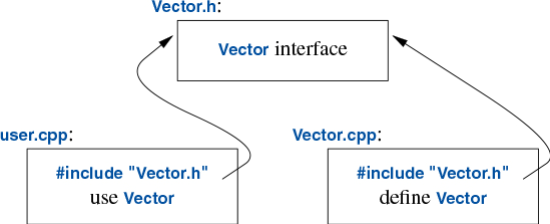
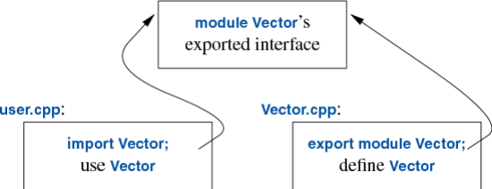

# 3.2 分离编译

C++ 支持“分离编译”：用户代码只需看到所用类型与函数的声明。实现方式有两种：

- **头文件**（[§3.2.1](3-2-separate-compilation.md#3.2.1)）：把声明放进单独的文件（头文件），在需要这些声明的地方用 `#include` 文本包含该头文件。
- **模块**（[§3.2.2](3-2-separate-compilation.md#3.2.2)）：定义模块文件，单独编译，再在需要处 `import`。只有被显式导出的声明，才会被导入该模块的代码看见。

二者都可以把程序组织成一组相对独立的代码片段。这种划分既能缩短编译时间，也能强制隔离逻辑上彼此独立的部分（从而降低出错机会）。所谓“库”，往往就是一批经分离编译得到的代码片段（例如各种函数）的集合。

用头文件组织代码的做法可以追溯到 C 语言最早的年代，至今仍是最常见的方式。模块则是 C++20 的新机制，在代码整洁性和编译时间方面有巨大优势。

## 3.2.1 头文件

传统上，我们会把“被视为一个模块的那部分代码”的接口声明，放进一个文件名能体现其用途的文件里。例如：

```cpp
// Vector.h:

class Vector {
public:
    Vector(int s);
    double& operator[](int i);
    int size();
private:
    double* elem;   // elem 指向含有 sz 个 double 的数组
    int sz;
};
```

这段声明会放在文件 `Vector.h` 中。用户通过 `#include` 该文件（称为*头文件*）来访问这个接口。例如：

```cpp
// user.cpp:

#include "Vector.h"     // 取得 Vector 的接口
#include <cmath>        // 取得标准库数学函数接口，包括 sqrt

double sqrt_sum(const Vector& v)
{
    double sum = 0;
    for (int i = 0; i != v.size(); ++i)
        sum += std::sqrt(v[i]);     // 平方根之和
    return sum;
}
```

为帮助编译器保证一致性，提供 `Vector` 实现的 `.cpp` 文件也会包含提供其接口的 `.h` 文件：

```cpp
// Vector.cpp:

#include "Vector.h"     // 取得 Vector 的接口

Vector::Vector(int s)
    :elem{new double[s]}, sz{s}     // 初始化成员
{
}

double& Vector::operator[](int i)
{
    return elem[i];
}

int Vector::size()
{
    return sz;
}
```

`user.cpp` 与 `Vector.cpp` 共享 `Vector.h` 中给出的 `Vector` 接口信息，但除此之外彼此独立，可以分别编译。用图表示这些程序片段如下：



组织程序的最佳思路，是把程序看成一组依赖关系清晰的模块。头文件用文件来表达这种模块性，再通过分离编译来利用这种模块性。

一个被单独编译的 `.cpp` 文件（连同它 `#include` 的各个 `.h` 文件）称为一个*翻译单元*（translation unit）。一个程序可以由成千上万个翻译单元组成。

用头文件和 `#include` 来模拟模块性是一种非常古老的做法，有显著缺点：

- **编译时间**：若在 101 个翻译单元中 `#include header.h`，则 `header.h` 的文本会被编译器处理 101 次。
- **顺序依赖**：若先 `#include header1.h` 再 `#include header2.h`，则 `header1.h` 中的声明和宏（[§19.3.2.1](../ch19/19-3-c-cpp-compatibility.md#19.3.2.1)）可能影响 `header2.h` 中代码的含义；若顺序反过来，则可能是 `header2.h` 影响 `header1.h`。
- **不一致**：在一个文件中定义某个实体（类型或函数），又在另一个文件中以略有不同的方式再定义一次，可能导致崩溃或难以察觉的错误。若我们——无意或有意地——在两个源文件中分别声明同一实体而不把它放进头文件，或因不同头文件之间的顺序依赖，都可能出现这种情况。
- **传递性**：表达头文件中某条声明所需的全部代码都必须出现在该头文件中。这会导致严重的代码膨胀——头文件再 `#include` 其他头文件——进而使用户——无意或有意地——依赖这些实现细节。

显然，这并不理想；自该技术在 1970 年代初引入 C 以来，它一直是成本和缺陷的主要来源之一。不过，头文件已沿用数十年，大量使用 `#include` 的旧代码还会“存活”很久，因为更新大型程序既昂贵又耗时。

## 3.2.2 模块

在 C++20 中，我们终于有了由语言直接支持的模块化表达方式（[§19.2.4](../ch19/19-2-cpp-evolution.md#19.2.4)）。考虑如何用模块来表达 [§3.2](3-2-separate-compilation.md) 中的 `Vector` 与 `sqrt_sum()` 例子：

```cpp
export module Vector;     // 定义名为 "Vector" 的模块

export class Vector {
public:
    Vector(int s);
    double& operator[](int i);
    int size();
private:
    double* elem;   // elem 指向含有 sz 个 double 的数组
    int sz;
};

Vector::Vector(int s)
    :elem{new double[s]}, sz{s}     // 初始化成员
{
}

double& Vector::operator[](int i)
{
    return elem[i];
}

int Vector::size()
{
    return sz;
}

export bool operator==(const Vector& v1, const Vector& v2)
{
    if (v1.size() != v2.size())
        return false;
    for (int i = 0; i < v1.size(); ++i)
        if (v1[i] != v2[i])
            return false;
    return true;
}
```

这定义了名为 `Vector` 的模块，它导出类 `Vector`、其全部成员函数，以及定义 `==` 运算符的那个非成员函数。

使用模块的方式是在需要处导入它。例如：

```cpp
// file user.cpp:

import Vector;          // 取得 Vector 的接口
#include <cmath>        // 取得标准库数学函数接口，包括 sqrt

double sqrt_sum(Vector& v)
{
    double sum = 0;
    for (int i = 0; i != v.size(); ++i)
        sum += std::sqrt(v[i]);     // 平方根之和
    return sum;
}
```

我本也可以导入标准库的数学函数，但这里故意用了老式的 `#include`，以说明新旧可以混用。这种混用对于把旧代码从 `#include` 逐步升级到 `import` 至关重要。

头文件与模块的差别不只是语法上的：

- 模块只编译一次（而不是在每个使用它的翻译单元中各编译一次）。
- 两个模块以任意顺序导入，含义都不变。
- 若你向某个模块 `import` 或 `#include` 了什么，该模块的用户并不会隐式获得（也不会被打扰到）那些内容：`import` 不传递。

对可维护性和编译性能的影响可以非常显著。例如，我测过“Hello, World!”程序：使用

```cpp
import std;
```

的版本，比使用

```cpp
#include <iostream>
```

的版本大约快 10 倍。尽管模块 `std` 包含整个标准库，信息量比 `<iostream>` 头文件多十倍以上，仍然如此。原因在于：模块只导出接口，而头文件会把直接或间接包含的一切都交给编译器。于是我们可以使用大型模块，而不必去记那一大堆头文件该 `#include` 哪一个（[§9.3.4](../ch09/9-3-standard-library-organization.md#9.3.4)）。从这里起，除非另有说明，示例中一律假定使用 `import std`。

遗憾的是，模块 `std` 并不是 C++20 标准的一部分。若标准库实现尚未提供它，[附录 A](../ch-appendix/index.md) 说明了如何获得一个 `std` 模块。

定义模块时，我们不必把声明与定义拆到不同文件；若这样更利于组织源码，可以拆，但不是必须。简单的 `Vector` 模块也可以写成：

```cpp
export module Vector;    // 定义名为 "Vector" 的模块

export class Vector {
    // ...
};

export bool operator==(const Vector& v1, const Vector& v2)
{
    // ...
}
```

用图表示这些程序片段如下：



编译器会根据 `export` 说明符，把模块的接口与实现细节分开。因此，`Vector` 接口由编译器生成，用户从不需要显式命名它。

使用模块时，我们不必为了向用户隐藏实现细节而把代码写得很复杂；模块只会授予对已导出声明的访问权。例如：

```cpp
export module vector_printer;

import std;

export
template<typename T>
void print(std::vector<T>& v)   // 这是用户能看到的（唯一）函数
{
    cout << "{\n";
    for (const T& val : v)
        std::cout << " " << val << '\n';
    cout << '}';
}
```

导入这个不起眼的模块，并不会突然让我们获得整个标准库的访问权。

`template<typename T>` 是用类型对函数做参数化的写法（[§7.2](../ch07/7-2-parameterized-types.md)）。
