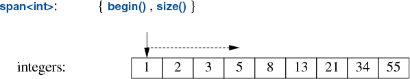

# 15.2 指针

指针这一笼统观念指的是：允许我们引用对象并按其类型去访问它的某种手段。内置指针例如 `int*` 只是一种特例；此外还有许许多多形态。

**指针**

| 记号 | 含义 |
|------|------|
| `T*` | 内置指针：指向类型 `T` 的对象，或指向一段连续分配的 `T` 元素序列 |
| `T&` | 内置引用：引用类型 `T` 的对象；相当于隐式解引用的指针（[§1.7](../ch01/1-7-pointers-arrays.md)） |
| `unique_ptr<T>` | 指向 `T` 的拥有型指针 |
| `shared_ptr<T>` | 指向类型 `T` 对象的指针；所有权由所有指向该 `T` 的 `shared_ptr` 共享 |
| `weak_ptr<T>` | 指向由 `shared_ptr` 拥有的对象；必须先转成 `shared_ptr` 才能访问 |
| `span<T>` | 指向一段连续的 `T` 序列（[§15.2.2](15-2-pointers.md#15.2.2)） |
| `string_view` | 指向常量子串（[§10.3](../ch10/10-3-string-view.md)） |
| `X_iterator<C>` | 来自 `C` 的元素序列；名称中的 `X` 指明迭代器类别（[§13.3](../ch13/13-3-iterator-types.md)） |

同一个对象可以同时被多个指针指到。**拥有型指针**负责最终销毁所指对象；**非拥有指针**（如 `T*`、`span`）则可能悬空——指向早已销毁或离开作用域之处。

经由悬空指针读写是最棘手的一类错误之一：语义上是未定义行为。实践中常常表现为碰巧读写到了别处占用的一块内存：读出任意比特，写入破坏无关数据结构。最体面的下场往往是崩溃——而这常常好过静默的错误。

《C++ 核心准则》[CG] 给出了如何避免悬空指针的规则与可做静态检查的建议。下面是几条实操层面的防线：

- 不要在局部对象离开作用域后仍保留指向它的指针。尤其不要从函数返回指向局部对象的指针，也不要把来路不明的指针存进长寿数据结构。系统化地使用容器与算法（[第 12 章](../ch12/index.md)、[第 13 章](../ch13/index.md)）常常使我们免于采用那些难以避免指针问题的编程技法。
- 对在自由存储上分配的对象使用拥有型指针。
- 指向静态对象（例如全局变量）的指针不会悬空。
- 把指针算术留给资源句柄的实现（例如 `vector` 与 `unordered_map`）。
- 记住 `string_view` 与 `span` 是非拥有指针的种类。

## 15.2.1 `unique_ptr` 与 `shared_ptr`

任何一个非平凡程序的关键任务之一，就是管理资源。**资源**指必须先获取、之后再（显式或隐式）释放的东西。例子包括内存、锁、套接字、线程句柄、文件句柄等。对长跑程序而言，未能及时释放资源（“泄漏”）可能造成严重的性能退化（[§12.7](../ch12/12-7-allocators.md)），甚至更糟糕的崩溃。即便是短程序，泄漏也可能令人尴尬——例如因资源短缺把运行时间拖垮好几个数量级。

标准库组件被设计成不泄漏资源。为此，它们依赖语言对资源管理的基本支持：用构造函数/析构函数成对，确保资源不会比负责它的对象活得更久。`Vector` 用构造函数/析构函数管理元素生命周期的示例（[§5.2.2](../ch05/5-2-concrete-types.md#5.2.2)）就是一例；所有标准库容器都以类似方式实现。重要的是，这一做法与基于异常的错误处理正确协作。例如，标准库的锁类使用了该技术：

```cpp
mutex m; // 用于保护共享数据

void f()
{
    scoped_lock lck {m}; // 构造阶段占有互斥量 m
    // ... 操纵共享数据 ...
}
```

线程在 `lck` 的构造函数获取互斥量之前不会继续前进（[§18.3](../ch18/18-3-shared-data.md)）。对应的析构函数释放互斥量。因此在该例中，当控制流离开 `f()`（通过 `return`、从函数末尾“坠落”，或通过抛出异常）时，`scoped_lock` 的析构函数会释放互斥量。

这便是 **RAII**（“资源获取即初始化”技术；[§5.2.2](../ch05/5-2-concrete-types.md#5.2.2)）的应用。RAII 是 C++ 中惯用资源处理的基础。容器（例如 `vector` 与 `map`）、`string` 以及 `iostream` 也以类似方式管理各自的资源（例如文件句柄与缓冲区）。

到目前为止的例子处理的是在作用域内定义的对象，在离开作用域时释放它们获取的资源；那自由存储上分配的对象呢？在 `<memory>` 中，标准库提供两个“智能指针”来帮助管理自由存储上的对象：

- `unique_ptr` 表示独占所有权（其析构函数销毁对象）
- `shared_ptr` 表示共享所有权（最后一个共享指针的析构函数销毁对象）

这些“智能指针”最基本的用途，是防止因粗心编程导致的内存泄漏。例如：

```cpp
void f(int i, int j) // X* 对比 unique_ptr<X>
{
    X* p = new X;
    unique_ptr<X> sp {new X};
    // ...

    if (i < 99)
        throw Z{};      // 可能抛异常
    if (j < 77)
        return;         // 可能提前返回
    // ... 使用 p 与 sp ...
    delete p;           // 销毁 *p
}
```

这里，若 `i<99` 或 `j<77`，我们“忘记”了 `delete p`。另一方面，`unique_ptr` 确保不论我们以何种方式退出 `f()`（抛出异常、执行 `return`，或从函数末尾“坠落”），其对象都会被妥善销毁。颇具讽刺意味的是，我们本可以干脆不用指针、也不用 `new` 来解决问题：

```cpp
void f(int i, int j)      // 使用局部变量
{
    X x;
    // ...
}
```

不幸的是，`new`（以及指针与引用）的过度使用似乎正在成为一个日益严重的问题。

不过，当你确实需要指针语义时，`unique_ptr` 是一种轻量机制，相对正确使用内置指针而言没有额外的空间或时间开销。它的进一步用途包括把自由存储分配的对象传入和传出函数：

```cpp
unique_ptr<X> make_X(int i)
    // 创建 X 并立刻交给 unique_ptr
{
    // ... 校验 i 等等 ...
    return unique_ptr<X>{new X{i}};
}
```

`unique_ptr` 是单个对象（或数组）的句柄，很大程度上就像 `vector` 是对象序列的句柄。二者都（用 RAII）控制其他对象的生命周期，并都依赖消除拷贝或依赖移动语义，使返回简单且高效（[§6.2.2](../ch06/6-2-copy-move.md#6.2.2)）。

`shared_ptr` 与 `unique_ptr` 类似，区别在于 `shared_ptr` 是拷贝而非移动。同一对象的各个 `shared_ptr` 共享该对象的所有权；当最后一个 `shared_ptr` 被销毁时，该对象才被销毁。例如：

```cpp
void f(shared_ptr<fstream>);
void g(shared_ptr<fstream>);

void user(const string& name, ios_base::openmode mode)
{
    shared_ptr<fstream> fp {new fstream(name, mode)};
    if (!*fp)                   // 确认文件确实打开成功
        throw No_file{};

    f(fp);
    g(fp);
    // ...
}
```

现在，由 `fp` 的构造函数打开的文件，会由最后一个（显式或隐式）销毁 `fp` 副本的函数关闭。注意 `f()` 或 `g()` 可能派生一个持有 `fp` 副本的任务，或以其他方式保存一个比 `user()` 活得更久的副本。因此，`shared_ptr` 提供了一种尊重基于析构函数的资源管理的垃圾回收形式。这既不是零成本，也谈不上极其昂贵，但确实使共享对象的寿命难以预测。**只在你确实需要共享所有权时才使用 `shared_ptr`。**

先在自由存储上创建对象，再把指向它的指针交给智能指针，写法略显啰嗦。这也容易出错，例如忘记把指针交给 `unique_ptr`，或把并非自由存储上对象的指针交给 `shared_ptr`。为避免这类问题，标准库（在 `<memory>` 中）提供了构造对象并返回相应智能指针的函数：`make_shared()` 与 `make_unique()`。例如：

```cpp
struct S {
    int i;
    string s;
    double d;
    // ...
};

auto p1 = make_shared<S>(1, "Ankh Morpork", 4.65); // shared_ptr<S>
auto p2 = make_unique<S>(2, "Oz", 7.62);         // unique_ptr<S>
```

现在，`p2` 是一个 `unique_ptr<S>`，指向自由存储上分配的、值为 `{2,"Oz"s,7.62}` 的 `S` 对象。

使用 `make_shared()` 不仅比分别用 `new` 创建对象再交给 `shared_ptr` 更方便——它也明显更高效，因为它不必为 `shared_ptr` 实现所必需的使用计数再做一次单独分配。

有了 `unique_ptr` 与 `shared_ptr`，对许多程序我们可以贯彻完整的“禁止裸 `new`”策略（[§5.2.2](../ch05/5-2-concrete-types.md#5.2.2)）。然而，这些“智能指针”在概念上仍是指针，因此在资源管理上只是我的第二选择——排在容器以及其他在更高概念层次上管理资源的类型之后。尤其是，`shared_ptr` 本身并不提供关于哪些所有者可以读和/或写共享对象的任何规则。仅仅消除资源管理问题，并不能解决数据竞争（[§18.5](../ch18/18-5-inter-task-communication.md)）以及其他形式的混淆。

我们何时使用“智能指针”（如 `unique_ptr`），而非为资源专门设计操作的资源句柄（如 `vector` 或 `thread`）？毫不意外，答案是“当我们需要指针语义时”。

- 当我们共享一个对象时，需要指针（或引用）来指称该共享对象，因此 `shared_ptr` 成为显然的选择（除非存在显然的单一所有者）。
- 当我们在经典面向对象代码（[§5.5](../ch05/5-5-hierarchies.md)）中引用多态对象时，需要指针（或引用），因为我们不知道所指对象的确切类型（甚至不知道其大小），因此 `unique_ptr` 成为显然的选择。
- 共享的多态对象通常需要 `shared_ptr`。
- 我们不必用指针从函数返回一组对象；作为资源句柄的容器可以依靠拷贝省略（[§3.4.2](../ch03/3-4-parameters.md#3.4.2)）与移动语义（[§6.2.2](../ch06/6-2-copy-move.md#6.2.2)）简洁高效地完成。

## 15.2.2 `span`

长久以来，范围错误一直是 C 与 C++ 程序中严重错误的主要来源，导致错误结果、崩溃与安全问题。使用容器（[第 12 章](../ch12/index.md)）、算法（[第 13 章](../ch13/index.md)）与范围 `for` 已显著减轻这一问题，但还能做得更多。范围错误的一个关键来源是：人们传入指针（裸的或智能的），然后依赖约定来知道所指元素的个数。对资源句柄之外的代码，最佳建议是假定至多指向一个对象 [CG: F.22]，但若没有支撑，这条建议难以落实。

标准库的 `string_view`（[§10.3](../ch10/10-3-string-view.md)）可以帮忙，但它只读且仅面向字符。多数程序员需要更多。例如，在较低层软件中向缓冲区写入、从缓冲区读出时，既要保持高性能又要避免范围错误（“缓冲区溢出”）出了名地困难。来自 `<span>` 的 `span` 本质上就是表示元素序列的（指针，长度）对：



`span` 提供对连续元素序列的访问。这些元素可以多种方式存储，包括在 `vector` 与内置数组中。与指针一样，`span` 并不拥有它指向的字符。在这一点上，它类似于 `string_view`（[§10.3](../ch10/10-3-string-view.md)）以及 STL 的一对迭代器（[§13.3](../ch13/13-3-iterator-types.md)）。

考虑一种常见的接口风格：

```cpp
void fpn(int* p, int n)
{
    for (int i = 0; i < n; ++i)
        p[i] = 0;
}
```

我们假定 `p` 指向 `n` 个整数。不幸的是，这一假定只是约定，因此我们不能据此写出范围 `for` 循环，编译器也无法实现廉价而有效的范围检查。此外，我们的假定还可能是错的：

```cpp
void use(int x)
{
    int a[100];
    fpn(a, 100);      // OK
    fpn(a, 1000);     // 糟糕，手指滑了！（fpn 中的范围错误）
    fpn(a + 10, 100); // fpn 中的范围错误
    fpn(a, x);        // 可疑，但看起来无害
}
```

使用 `span` 可以做得更好：

```cpp
void fs(span<int> p)
{
    for (int& x : p)
        x = 0;
}
```

我们可以这样使用 `fs`：

```cpp
void use(int x)
{
    int a[100];
    fs(a);             // 隐式创建 span<int>{a,100}
    fs(a, 1000);       // 错误：期望 span
    fs({a + 10, 100}); // fs 中的范围错误
    fs({a, x});        // 明显可疑
}
```

也就是说，常见情形——直接从数组创建 `span`——现在既安全（由编译器计算元素个数）又记法简单。在其他情形下，出错概率降低，错误也更容易察觉，因为程序员必须显式拼出 `span`。

把 `span` 从函数传到函数的常见情形，也比（指针，计数）接口更简单，而且显然不需要额外检查：

```cpp
void f1(span<int> p);

void f2(span<int> p)
{
    // ...
    f1(p);
}
```

与容器类似：`span` 的下标 `r[i]` 不做范围检查，越界访问仍是未定义行为。实现当然可以把这种未定义行为实现成抛出异常，但遗憾的是鲜有实现这么做。《C++ 核心准则》支撑库中的原始 `gsl::span` 则会进行范围检查（参见 [CG]）。
